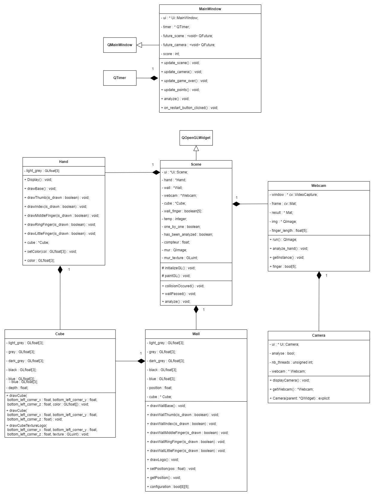

<div align="center">
    
    <h3 align="center">Hand Game</h3>
    <p align="center">Hand tracking with a camera</p>
    <br />
</div>
<br/>

## Presentation of the app

### Interaction with the user

<br/>
As the application starts, the game is on pause. The user needs to click on the `Start` button to begin the game. The camera is not displayed if the player hasn't clicked on the start button.

<br/>
When the user loses, a `Game Over` messages pops and the final score is shown. The user can choose to restart the game. The score is reset if the user loses.

### Hand detection zone

<div>
    
    
</div>
The detection zone is the zone where the back of the hand becomes green and turns progressively orange. The detection is made **at the end of this zone**. When the zone is over, the hand's color turns back to grey.

### Default behavior

The application has some default behavior that one must know in order to enjoy the game to its fullest :  
- if no hand is detected, the default configuration is a full hand (5 fingers up)
- due to the inconsistency of the hand detection algorithm, a hand configuration can sometimes be wrongly analyzed or detected

## Structure

### Class diagram



### Class descprition

>`Cube` handles the creation of a cube given some coordinates.

>`Hand` and `Wall` are the classes that create the hand and wall with cubes. They are similar in their functionnality and behavior. The idea is to identify the elements that will always be displayed. For example, the fingers will not always be drawn, but the base of the hand will be, so there is no need for it to be coded more than once.  
A finger is to be drawn if the function that is assigned to this specific finger is given the argument `true` and vice versa.

>`Camera` handles the display of the camera.

>`Webcam` creates the image that is to be displayed by the `Camera` class. It also deals with the hand detection. 

>`Scene` draws the 3D scene and emit signals if some conditions are met.

>`Mainwindow` handles the display of every object on the app window. This class receives all the signals and display the appropriate content.

>### Multithreading
>
>In order to have a fluid application, we chose to use `QtConcurrent` which allows to execute a task in an independant thread. The 3D scene and the hand detection are both executed in a thread, while the rest of the application is executed normally. Thus the application runs without any major drop in performances.

## Supported hand configurations

The supported hand position are the following :  


## Requirements checklist

- [x] wall built with cubes
- [x] display of a wall with a hole in the shape of a hand
- [x] point of view and light set so there is a 3D look
- [x] TSE logo on the wall
- [x] wall with texture
- [x] hand built with cubes so that a hand shape is recognizable
- [x] fingers are recognizable
- [x] hand configuration detection
- [x] update of the hand
- [x] great latency
- [x] webcam zone
- [x] collision detection
- [x] visual effect when collision (game over)
- [x] score and restart button

## Class header

`camera.h` :
```c++
#ifndef CAMERA_H
#define CAMERA_H

#include "webcam.h"
#include <QWidget>
#include <QImage>

QT_BEGIN_NAMESPACE
namespace Ui {
class Camera;
}
QT_END_NAMESPACE

/*
 * This class handles the display of the webcam.
 *
 * @author : Matthieu d'Hoop
 */
class Camera : public QWidget
{
    Q_OBJECT
public:
    // Constructor
    explicit Camera(QWidget *parent = nullptr);
    // Display the image captionned by the webcam in the camera_label
    void displayCamera();
    // Returns the instance of the Webcam that is being used by the Camera
    Webcam* getWebcam();
    // Destructor
    ~Camera();

private:
    Ui::Camera *ui;
    Webcam *webcam;
    bool analyze;
    unsigned int nb_threads = std::thread::hardware_concurrency();

};

#endif // CAMERA_H
```
`cube.h` :
```c++
#ifndef CUBE_H
#define CUBE_H

#include <GL/gl.h>
#include <QtWidgets>

/*
 * This class handles the creation and display of a cube, given its position and/or its color.
 *
 * @author : Matthieu d'Hoop
 * @co-author : Alban Lemière
 */
class Cube {
private:
    GLfloat light_grey[3] = {0.7f, 0.7f, 0.7f};
    GLfloat grey[3] = {0.5f, 0.5f, 0.5f};
    GLfloat dark_grey[3] = {0.3f, 0.3f, 0.3f};
    GLfloat black[3] = {0.f, 0.f, 0.f};
    GLfloat blue[3] = {0.f, 0.f, 1.f};
    float depth;
public:
    // Constructor
    Cube(float depth);
    // Destructor
    ~Cube();
    // Draws a colored cube at the given coordinates
    void drawCube(float bottom_left_corner_x, float bottom_left_corner_y, float bottom_left_corner_z, GLfloat color[]);
    // Draws a cube that will be textured at the given coordinates
    void drawCube(float bottom_left_corner_x, float bottom_left_corner_y, float bottom_left_corner_z);
    // Draws a cube with the TSE logo on it at the given coordinates
    void drawCubeTextureLogo(float bottom_left_corner_x, float bottom_left_corner_y, float bottom_left_corner_z, GLuint texture);
};

#endif // CUBE_H
```

`hand.h` :
```c++

#ifndef HAND_H
#define HAND_H

#include "cube.h"

/*
 * This class handles the modelization of the hand, given the number of fingers that must be displayed.
 *
 * @author : Matthieu d'Hoop
 */
class Hand {
private:
    GLfloat light_grey[3] = {0.7f, 0.7f, 0.7f};

public:
    // Constructor
    Hand();
    // Destructor
    ~Hand();
    // Draws the base oh the hand (the cubes that are always displayed no matter the configuration)
    void drawBase();
    // Draws the thumb (always called so a boolean is given as an argument)
    void drawThumb(boolean is_drawn);
    // Draws the index (always called so a boolean is given as an argument)
    void drawIndex(boolean is_drawn);
    // Draws the middle finger (always called so a boolean is given as an argument)
    void drawMiddleFinger(boolean is_drawn);
    // Draws the ring finger (always called so a boolean is given as an argument)
    void drawRingFinger(boolean is_drawn);
    // Draws the little finger (always called so a boolean is given as an argument)
    void drawLittleFinger(boolean is_drawn);
    // Sets the color of the back of the hand
    void setColor(GLfloat col[3]);
    Cube *cube;
    GLfloat color[3];
};

#endif // HAND_H
```

`mainwindow.h` : 
```c++

#ifndef MAINWINDOW_H
#define MAINWINDOW_H

#include <QMainWindow>
#include <QTimer>
#include <QFuture>

QT_BEGIN_NAMESPACE
namespace Ui { class MainWindow; }
QT_END_NAMESPACE


/*
 * This class manages the general layout and events of the application.
 * It handles all the signals of the app.
 *
 * @author : Matthieu d'Hoop
 */
class MainWindow : public QMainWindow

{
    Q_OBJECT

public:
    MainWindow(QWidget *parent = nullptr);
    ~MainWindow();

private:
    Ui::MainWindow *ui;
    QTimer *timer;
    QFuture<void> future_scene;
    QFuture<void> future_camera;
    int score;
    bool start;

private slots:
    // Updates the 3D scene
    void update_scene();
    // Updates the camera frame
    void update_camera();
    // Updates the game over state
    void update_game_over();
    // Updates the score of the player
    void update_points();
    // Start the hand detection
    void analyze();
    // Handles the event "restart button clicked"
    void on_restart_button_clicked();
    // Handles the event "start button clicked"
    void on_start_button_clicked();
};

#endif // MAINWINDOW_H
```

`scene.h` : 
```c++
#ifndef SCENE_H
#define SCENE_H

#include <QOpenGLWidget>
#include <GL/glu.h>
#include "hand.h"
#include <QTimer>
#include "webcam.h"
#include "wall.h"

namespace Ui {
class Scene;
}


/*
 * This class draws the 3D scene and send signals if some conditions are met.
 *
 * @author : Matthieu d'Hoop
 * @co-author : Alban Lemière
 */
class Scene : public QOpenGLWidget
{
    Q_OBJECT

protected:
    void initializeGL();
    void paintGL();

public:
    // Constructor
    explicit Scene(QWidget *parent = nullptr);
    // Allows to link the webcam that analyzes the hand and the 3D scene (link Webcam and Scene)
    void setWebcam(Webcam *webcam);
    // Destructor
    ~Scene();

private:
    Ui::Scene *ui;
    Hand *hand;
    Wall *wall;
    Webcam *webcam;
    Cube *cube;
    bool wall_finger[5] = {true, true, true, true, true};
    int temp = 0;
    bool one_by_one;
    bool has_been_analyzed;
    float compteur;
    QImage mur;
    GLuint mur_texture;

signals:
    // The following signals must be sent when :
    // A collision happened
    void collisionOccured();
    // The wall has been passed
    void wallPassed();
    // The hand must be analyzed
    void analyze();
};

#endif // SCENE_H
```

`wall.h` :
```c++
#ifndef WALL_H
#define WALL_H

#include "cube.h"
#include <GL/glu.h>
#include <QtWidgets>

/*
 * This class handles the modelization of the wall given the number of fingers that is randomly selected.
 *
 * @author : Alban Lemière
 * @co-author : Matthieu d'Hoop
 */
class Wall {
private:
    GLfloat light_grey[3] = {0.7f, 0.7f, 0.7f};
    GLfloat grey[3] = {0.5f, 0.5f, 0.5f};
    GLfloat dark_grey[3] = {0.3f, 0.3f, 0.3f};
    GLfloat black[3] = {0.f, 0.f, 0.f};
    GLfloat blue[3] = {0.f, 0.f, 1.f};
    float position;
    Cube *cube;

public:
    Wall();
    ~Wall();
    // Draws the cubes that are always displayed no matter the configuration
    void drawWallBase();
    // Draws the hole for the thumb or not
    void drawWallThumb(boolean is_drawn);
    // Draws the index for the thumb or not
    void drawWallIndex(boolean is_drawn);
    // Draws the hole for the middle finger or not
    void drawWallMiddleFinger(boolean middleWall_is_drawn, boolean indexWall_is_drawn, boolean ringWall_is_drawn);
    // Draws the hole for the ring finger or not
    void drawWallRingFinger(boolean is_drawn);
    // Draws the hole for the ring finger or not
    void drawWallLittleFinger(boolean littleWallis_drawn, boolean ringWall_is_drawn);
    // Draws the logo of TSE
    void drawLogo();
    // Sets the position of the wall, allowing the translation
    void setPosition(float pos);
    // Gets the position of the wall, allowing to track its progress
    float getPosition();
    // Stores the hand configuration for the wall
    bool configuration[8][5] = {
        {true, true, true, true, true},
        {false, true, true, true, true},
        {true, true, false, false, false},
        {true, true, true, false, false},
        {false, false, false, false, false},
        {false, true, true, true, false},
        {false, true, false, false, false},
        {true, true, false, false, true}
    };
};

#endif // WALL_H
```

`webcam.h` :
```c++
#ifndef WEBCAM_H
#define WEBCAM_H

#include "qimage.h"
#include <future>
#include <opencv2/opencv.hpp>
#include <opencv2/highgui/highgui.hpp>
#include <vector>
#include <opencv2/dnn.hpp>
#include <opencv2/imgproc.hpp>
#include <opencv2/highgui.hpp>

using namespace cv;
using namespace cv::dnn;
#include <iostream>

/*
 * This class handles the hand detection and the generation of images for the video caption.
 *
 * @author : Matthieu d'Hoop
 */
class Webcam
{
public:
    Webcam();
    ~Webcam();
    // Generates the image from the webcam and returns it
    QImage run();
    // Analyzes the hand configuration
    void analyze_hand();
    // Gets the current instance of the Webcam
    static Webcam* getInstance();
    // Stores the detected hand configuration
    bool finger[5] = {true, true, true, true, true};

private:
    cv::VideoCapture *window;
    cv::Mat frame;
    Mat *result;
    QImage *img;
    static Webcam* s_instance;
    Net net;
    String modelTxt = samples::findFile("../hand_app/pose_iter_102000.caffemodel");
    String modelBin = samples::findFile("../hand_app/pose_deploy.prototxt");
    String dataset = "HAND";
    int W_in = 368;
    int H_in = 368;
    float thresh = 0.1;
    float scale  = 0.003922;
    int midx, npairs, nparts;

    float finger_length[5];


    const int POSE_PAIRS[3][20][2] = {
        {   // COCO body
            {1,2}, {1,5}, {2,3},
            {3,4}, {5,6}, {6,7},
            {1,8}, {8,9}, {9,10},
            {1,11}, {11,12}, {12,13},
            {1,0}, {0,14},
            {14,16}, {0,15}, {15,17}
        },
        {   // MPI body
            {0,1}, {1,2}, {2,3},
            {3,4}, {1,5}, {5,6},
            {6,7}, {1,14}, {14,8}, {8,9},
            {9,10}, {14,11}, {11,12}, {12,13}
        },
        {   // hand
            {0,1}, {1,2}, {2,3}, {3,4},         // thumb
            {0,5}, {5,6}, {6,7}, {7,8},         // pinkie
            {0,9}, {9,10}, {10,11}, {11,12},    // middle
            {0,13}, {13,14}, {14,15}, {15,16},  // ring
            {0,17}, {17,18}, {18,19}, {19,20}   // small
        }
    };
};

#endif
```
