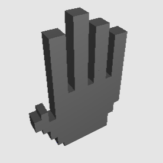

    
    <h3 align="center">Hand Game</h3>
    
Hand tracking with a camera

     

 

## Structure

## Presentation of the app

>### Interaction with the user
>
>As the application starts, the game is on pause. The user needs to click on the `Start` button to begin the game. The camera is not displayed if the player hasn't clicked on the start button.

>When the user loses, a `Game Over` messages pops and the final score is shown. The user can choose to restart the game. The score is reset if the user loses.

>### 3D drawing
>
>The idea of the drawing method is to identify the elements that will always be displayed. For example, the fingers will not always be drawn, but the base of the hand will be, so there is no need for it to be coded more than once.  
A finger is to be drawn if the function that is assigned to this specific finger is given the argument `true` and vice versa.  
This applies to the `Wall` and `Hand` class.  

>### Multithreading
>
>In order to have a fluid application, we chose to use `QtConcurrent` which allows to execute a task in an independant thread. The 3D scene and the hand detection are both executed in a thread, while the rest of the application is executed normally. Thus the application runs without any major drop in performances.

>### Signals
>
>All the `signals` are emitted by the `Scene` class, which draws the 3D scene. Such behavior allows to handle every event that may arise (game over, wall passed successfully, etc). All these signals are received by the `Mainwindow` class which modifies the displayed content.

## Hand Detection

The supported hand position are the following :  

## Presentation of the app

The application has some default behavior that one must know in order to enjoy the game to its fullest :  
- if no hand is detected, the default configuration is a full hand (5 fingers up)
- due to the inconsistency of the hand detection algorithm, a hand configuration can sometimes be wrongly analyzed or detected

## Requirements checklist

- [x] wall built with cubes
- [x] display of a wall with a hole in the shape of a hand
- [x] point of view and light set so there is a 3D look
- [x] TSE logo on the wall
- [x] wall with texture
- [x] hand built with cubes so that a hand shape is recognizable
- [x] fingers are recognizable
- [x] hand configuration detection
- [x] update of the hand
- [x] great latency
- [x] webcam zone
- [x] collision detection
- [x] visual effect when collision (game over)
- [x] score and restart button
